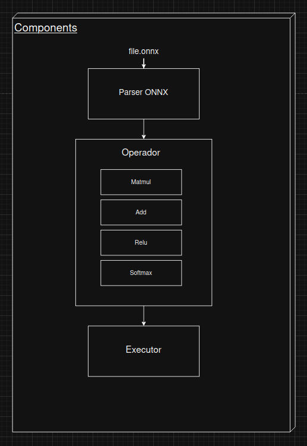
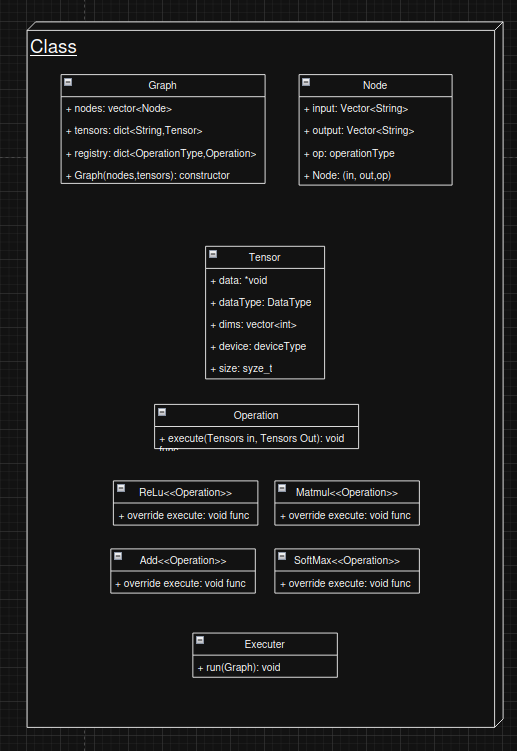

# Mini ONNX Inference Engine (C++)

Lightweight **C++ inference engine** for running neural network models exported to **ONNX** from frameworks like TensorFlow or PyTorch.

The goal of this project is to explore how modern inference runtimes work internally, focusing on:

- ONNX graph parsing
- tensor management
- operator execution
- graph-based model execution

---

## Architecture

The runtime is composed of three main layers:

- **ONNX Parser** – loads and converts the model into an internal graph  
- **Operator Layer** – implements operations such as `MatMul`, `Add`, `Relu`, `Softmax`  
- **Executor** – traverses the graph and runs each operation

---

## Core Classes

Main components:

- **Graph** – stores nodes and tensors  
- **Node** – represents an operation in the graph  
- **Tensor** – data container used by operators  
- **Operation** – base interface for all operators

---

## Status

Current stage: **architecture design**

Next steps:

- ONNX parser
- graph construction
- executor implementation
- operator kernels